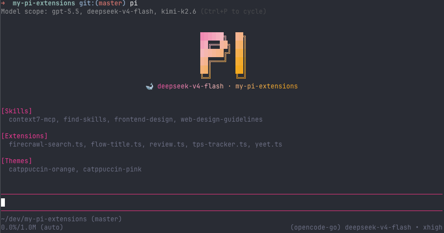

# 🧩 my-pi-extensions

> Local-first [pi](https://github.com/earendil-works/pi) extensions & skills — drop 'em in, level up.



## 📦 Extensions

| # | Extension | What it do |
|---|-----------|------------|
| 1 | 🔍 **[Firecrawl Search](./extensions/firecrawl-search.ts)** | Web search + page scraping via Firecrawl API. Adds `search` / `scrape` tools right into your agent. Drop a `FIRECRAWL_API_KEY` in your `.env` and go. |
| 2 | 🌈 **[Flow Title](./extensions/flow-title.ts)** | Gives the pi TUI a hot-pink / flashy-orange animated gradient header. The "PI" logo glows, sweeps, and vibes. Run `/flow-title` to flex. |
| 3 | ⚡ **[TPS Tracker](./extensions/tps-tracker.ts)** | Live tokens-per-second readout in the footer while streaming. Because knowing your speed is cool — and useful. |
| 4 | 🚀 **[Yeet](./extensions/yeet.ts)** | `/yeet` → git add, commit, and push in one shot. Optionally add extra instructions. Because typing three commands is for chumps. |
| 5 | 📋 **[Review](./extensions/review.ts)** | `/review` → code review with prioritized findings, verdicts, and human callouts. Supports PRs, branches, commits, uncommitted changes, and folder snapshots. Forked from [pi-review](https://github.com/earendil-works/pi-review) and adapted. |
| 6 | 🎯 **[Goal](./extensions/goal.ts)** | `/goal <objective>` → persistent Codex-style objective loop. Auto-continues across turns until verified complete, paused, blocked, or cleared. Adapted from the [Codex CLI](https://github.com/openai/codex) open-source /goal system. |

## 🎨 Themes

| # | Theme | What it looks like |
|---|-------|-------------------|
| 1 | 🟠 **[Catppuccin Orange](./themes/catppuccin-orange.json)** | Warm orange accents + Catppuccin Mocha base. Firey, but cozy. |
| 2 | 💗 **[Catppuccin Pink](./themes/catppuccin-pink.json)** | Hot pink accents + Catppuccin Mocha base. Bold and vibrant. |

Select one via `/settings` → Theme → `catppuccin-orange` or `catppuccin-pink`.

## 🎯 Skills

*(none yet — the skills folder is waiting for your brilliance)*

## 🚀 Install

```bash
pi install ~/dev/my-pi-extensions
```

Then reload pi:

```text
/reload
```

---

*Made with 💖 and questionable color choices.*
